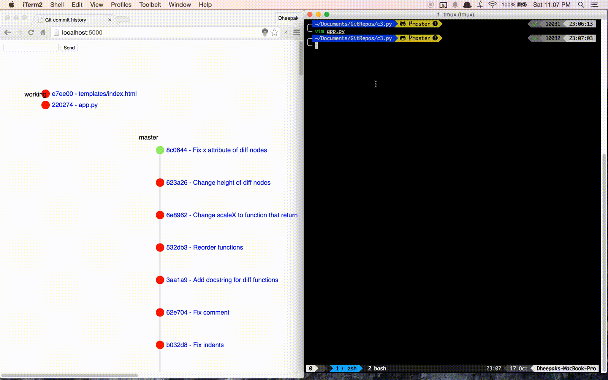

#C3.py

Commit Counter Chart is a Python Flask app to view git history using D3.js

The name is a play on D3.js. I wanted to play around with Flask and D3, and ended up visualizing git history as a form of a [live git log](https://gist.github.com/kdheepak89/411faf89190856c6458b)

# Contributions 

I highly welcome contributions. I would like to learn how to use d3.js / flask better.

# Installation

    pip install flask
    brew install graphviz
    pip install pygraphviz
    pip install gitpython
    pip install networkx
